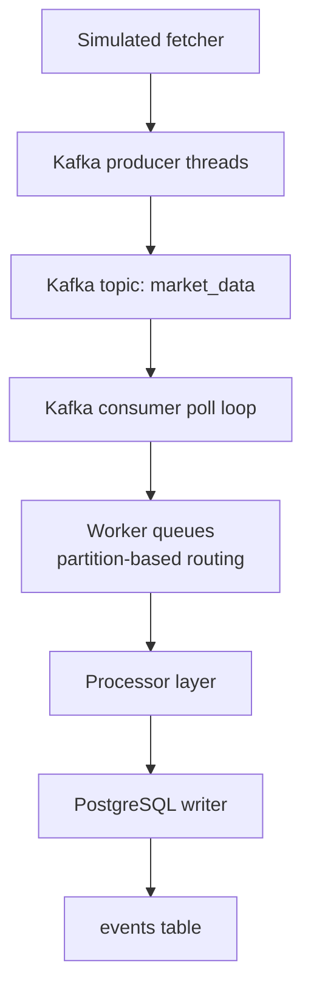

# Data Pipeline Project

A Python-based streaming data pipeline that simulates real-time market data ingestion using Kafka and PostgreSQL. The project demonstrates a producer-consumer architecture where simulated ticker data is published to Kafka, processed, and written to a relational database with batching and partition-aware consumer logic.

## Overview

This project is designed to model a production-style event pipeline:

- A producer fetches simulated market data for multiple tickers
- Messages are published to a Kafka topic using a partition key based on ticker
- A Kafka consumer reads batches of records and routes them by partition
- Worker threads process messages and insert them into PostgreSQL in batches
- Commit offsets are handled in a single-threaded commit queue to avoid Kafka consumer thread-safety issues

The design emphasizes throughput and reliability under load, with a focus on safe Kafka consumer usage and efficient database writes.

## Why this project exists

The project was built to explore and solve common production pipeline issues, including:

- Kafka consumer thread safety when multiple threads call `commit()` on the same consumer instance
- Slow message ingestion caused by per-message writes and naive polling patterns
- Need for ordered processing within a partition while still supporting parallel work
- Need for higher throughput through batched Kafka consumption and batched database inserts

## Architecture



### Key behaviors

- Messages are keyed by ticker, which determines Kafka partition placement
- Each partition is assigned to a single worker to preserve ordering by partition
- The main poll loop is the only place that commits Kafka offsets
- A commit queue serializes offset commits after successful DB writes
- PostgreSQL inserts use `ON CONFLICT DO NOTHING` to avoid duplicate writes

## Tech stack

- Python 3
- Kafka via Confluent Kafka client
- PostgreSQL 16
- Docker Compose for local infrastructure
- pytest for tests
- dotenv-based configuration

## Repository structure

```text
.
├── .env.example                # Example environment configuration
├── .gitignore
├── docker-compose.yml          # Kafka and PostgreSQL services
├── requirements.txt            # Python dependencies
├── notes.md                   # Design notes and performance observations
├── scripts/
│   ├── run_consumer.py         # Starts the Kafka consumer pipeline
│   └── run_producer.py         # Starts the Kafka producer pipeline
├── src/
│   ├── config/
│   │   └── config.py           # Pydantic settings and env loading
│   ├── consumers/
│   │   ├── base_consumer.py
│   │   └── kafka_consumer.py   # Partition-aware Kafka consumer
│   ├── fetchers/
│   │   ├── base_fetcher.py
│   │   └── simulated_fetcher.py
│   ├── processors/
│   │   ├── base_processor.py
│   │   └── simple_processor.py
│   ├── producers/
│   │   ├── base_producer.py
│   │   └── kafka_producer.py
│   ├── utils/
│   ├── writers/
│   │   ├── base_writer.py
│   │   └── postgres_writer.py
│   └── __init__.py
├── tests/
│   ├── test_base_producer.py
│   ├── test_config.py
│   ├── test_fetcher.py
│   └── test_kafka_producer.py
└── venv/
```

## Getting started

### 1. Clone the repository

```bash
git clone <repo-url>
cd data_pipeline_proj
```

### 2. Create your environment file

Copy the sample config file and adjust credentials and topics as needed:

```bash
cp .env.example .env
```

Example values in `.env` include:

```env
KAFKA_BOOTSTRAP_SERVERS=localhost:9092
TOPIC_NAME=market_data
CONSUMER_GROUP=processors
PRODUCER_THREADS=4
CONSUMER_THREADS=3

POSTGRES_HOST=localhost
POSTGRES_PORT=5432
POSTGRES_DB=data_pipeline
POSTGRES_USER=ches
POSTGRES_PASSWORD=your_password
```

### 3. Install Python dependencies

```bash
python3 -m venv .venv
source .venv/bin/activate
pip install -r requirements.txt
```

### 4. Start infrastructure

Start Kafka and PostgreSQL with Docker Compose:

```bash
docker compose up -d
```

This starts:

- Kafka on `localhost:9092`
- PostgreSQL on `localhost:5432`

### 5. Run the producer

```bash
python scripts/run_producer.py
```

This starts the simulated market data producer and sends messages to Kafka.

### 6. Run the consumer

In a separate terminal:

```bash
python scripts/run_consumer.py
```

The consumer connects to Kafka, reads messages, processes them, and writes rows to the `events` table in PostgreSQL.

## Database schema

The writer creates an `events` table if it does not already exist:

```sql
CREATE TABLE IF NOT EXISTS events (
    id SERIAL PRIMARY KEY,
    ticker VARCHAR(10) NOT NULL,
    price NUMERIC(10,2) NOT NULL,
    volume INT,
    event_time DOUBLE PRECISION NOT NULL,
    datetime TIMESTAMPTZ,
    created_at TIMESTAMPTZ DEFAULT CURRENT_TIMESTAMP,
    partition_id INT,
    offset_id BIGINT,
    UNIQUE (partition_id, offset_id)
);
```

This table is designed to support idempotent inserts and offset tracking for Kafka consumer commits.

## Example queries

Check the latest ingested data:

```sql
SELECT *
FROM events
ORDER BY created_at DESC
LIMIT 20;
```

Count rows by ticker:

```sql
SELECT ticker, COUNT(*)
FROM events
GROUP BY ticker
ORDER BY COUNT(*) DESC;
```

## Performance notes

This project includes a throughput-oriented design where Kafka and PostgreSQL writing are both batch-oriented:

- Kafka producer batches messages and uses linger settings
- Consumer pulls multiple Kafka messages per poll
- Worker threads accumulate batches before database insert
- PostgreSQL writes are done with `execute_values` for efficient bulk inserts
- Offset commits are batched and executed from a single thread

The project notes mention significant performance improvements after switching from one-message-at-a-time processing and unsynchronized commits to the commit queue + batched ingest strategy.

## Testing

Run the test suite with:

```bash
pytest -q
```

Tests cover the producer behavior, fetcher logic, and configuration defaults.

## Notes on the Kafka consumer fix

One of the main lessons in this project is that Kafka consumers are not safe to use concurrently from multiple threads when calling commit methods on the same object. In the original implementation, both the main poll loop and worker threads tried to commit offsets on the same consumer instance, which could lead to state corruption under load.

The fix was to:

- separate message processing from offset commits
- push commit information into a thread-safe queue
- let only the poll loop drain that queue and call `consumer.commit()`
- batch offset commits to reduce overhead

This pattern is a useful approach for maintaining Kafka correctness and throughput in concurrent systems.

## License

This project is provided as an example and learning project for pipeline engineering and Kafka/PostgreSQL integration patterns.

## Contributing

This repository is primarily intended for experimentation and educational use. Contributions, improvements, and architectural refinements are welcome if they improve performance, observability, or correctness.
